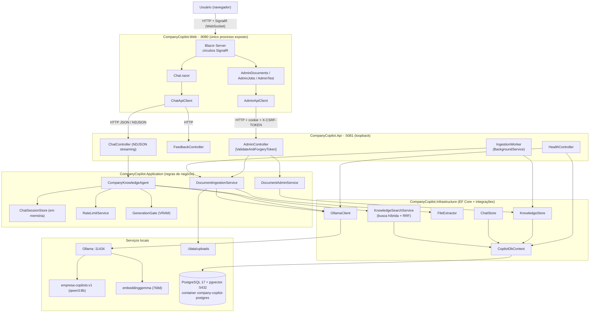
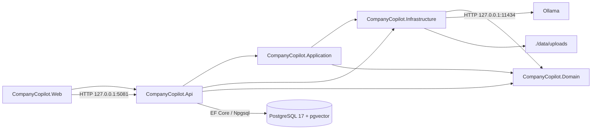
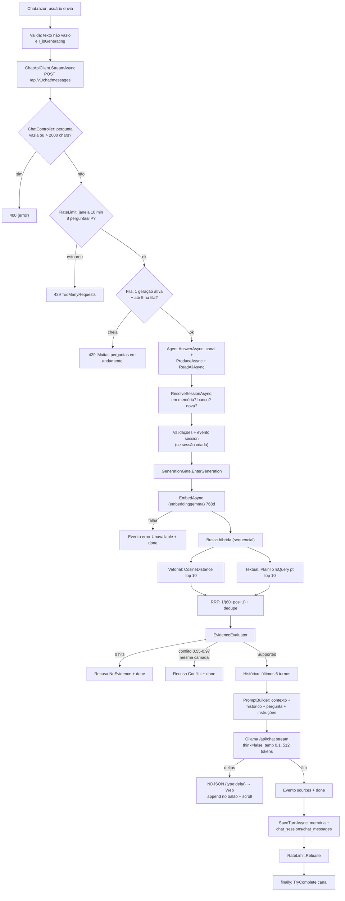
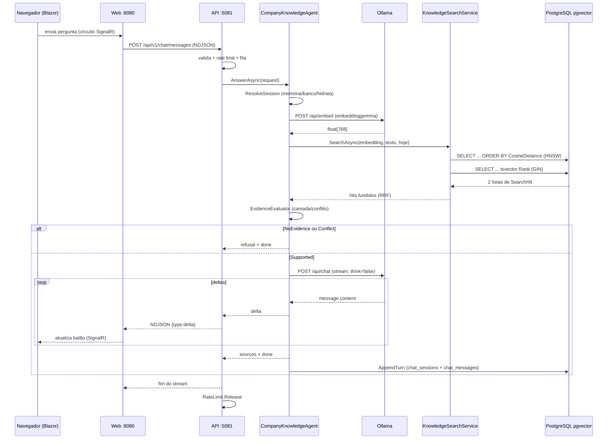
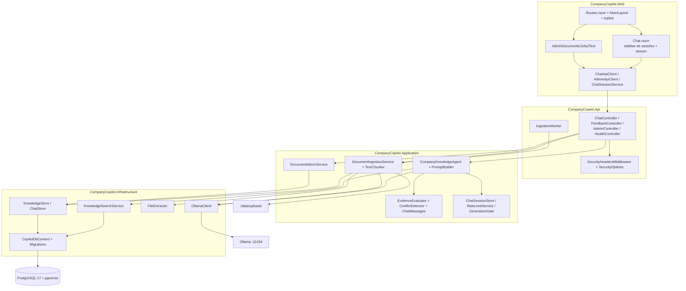
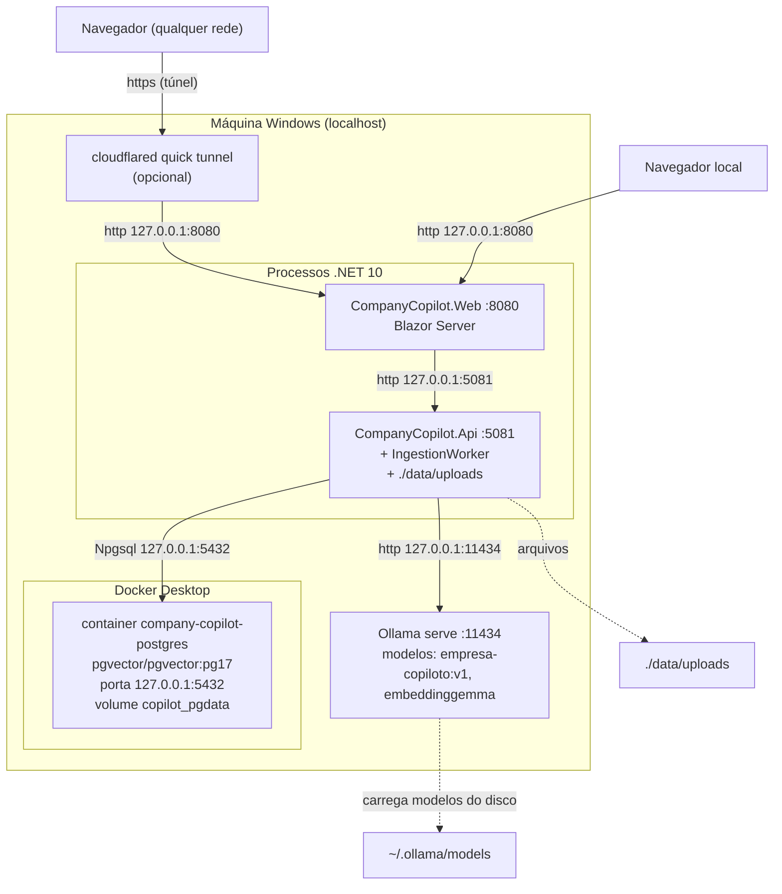
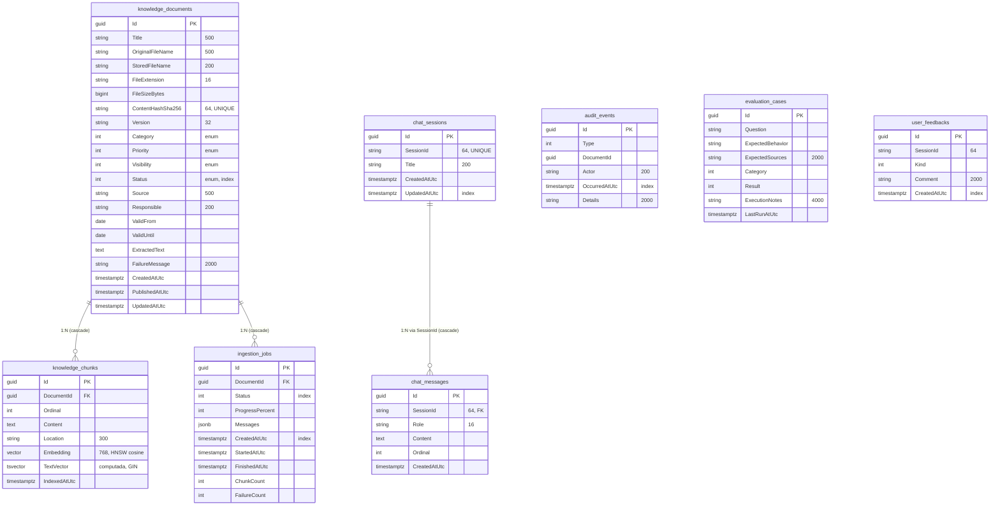

# Arquitetura do Copiloto RAG da Empresa

Assistente de chat consultivo (RAG) 100% local, em português do Brasil, que responde
exclusivamente com base em documentos aprovados pela empresa. Nenhuma operação é
executada pelo assistente (somente consulta). Toda a stack roda em loopback na
máquina; apenas a Web pode ser exposta externamente via Cloudflare Quick Tunnel.

- Solução: `CompanyCopilot.slnx` (.NET 10)
- Web (Blazor Server): `http://127.0.0.1:8080`
- API (ASP.NET Core): `http://127.0.0.1:5081`
- PostgreSQL 17 + pgvector (Docker): `127.0.0.1:5432`
- Ollama: `http://127.0.0.1:11434`

---

## 1. Inventário de tecnologias

| Tecnologia | Versão | Função | Onde é utilizada | Componentes dependentes | Etapa do fluxo |
|---|---|---|---|---|---|
| C# / .NET 10 | SDK 10.0.x | Linguagem e runtime | Todos os projetos (`src/*`, `tests/*`) | Todos | Todas |
| ASP.NET Core minimal hosting + MVC Controllers | 10.0.x | API HTTP | `src/CompanyCopilot.Api` | Web (clientes HTTP), `IngestionWorker` | Servir endpoints de chat, admin, feedback e health |
| Blazor Server (`InteractiveServer`) | 10.0.x | Front-end (Razor components, circuitos SignalR/WebSocket) | `src/CompanyCopilot.Web` | `Chat.razor`, páginas admin, `MainLayout`, `ReconnectModal` | Renderização e interatividade do chat e da administração |
| Razor + HTML + CSS (isolado e global) | — | UI/markup, `wwwroot/app.css`, `.razor.css` | `src/CompanyCopilot.Web` | Todas as páginas | Apresentação e responsividade |
| JavaScript (interop) | — | Scroll automático do chat, modal de reconexão | `wwwroot/chat.js`, `ReconnectModal.razor.js` | `Chat.razor` (`JS.InvokeVoidAsync("chatScrollBottom")`), `ReconnectModal` | Renderização pós-stream, reconexão de circuito |
| Entity Framework Core | 10.0.4 | ORM / acesso a dados | `src/CompanyCopilot.Infrastructure` (`CopilotDbContext`) | `KnowledgeStore`, `ChatStore`, `KnowledgeSearchService`, `HealthController`, migrations | Leitura/escrita em todas as operações de banco |
| Npgsql + Npgsql.EntityFrameworkCore.PostgreSQL | 10.0.3 | Driver PostgreSQL | `Infrastructure`, `Domain` (NpgsqlTsVector) | `CopilotDbContext` | Persistência e busca textual |
| Pgvector + Pgvector.EntityFrameworkCore | 0.3.2 / 0.3.0 | Vetores e similaridade cosseno | `Domain` (coluna `Embedding`), `Infrastructure` (`UseVector()`, `CosineDistance`) | `KnowledgeSearchService` (busca vetorial), `DocumentIngestionService` (embeddings) | Indexação e recuperação vetorial |
| PostgreSQL 17 + extensão `vector` | imagem `pgvector/pgvector:pg17` | Banco de dados (tabelas minúsculas, colunas PascalCase) | `infra/docker-compose.yml` (container `company-copilot-postgres`) | Toda a Infraestrutura | Persistência de documentos, trechos, jobs, auditoria, feedback, sessões |
| Ollama | 0.32.x (serviço local) | Servidor de inferência e embeddings | `http://127.0.0.1:11434` | `OllamaClient` | Geração de resposta (chat) e embeddings (ingestão) |
| Modelo de chat `empresa-copiloto:v1` | derivado de `qwen3:8b` | Geração de texto (streaming) | `docs/Modelfile` (SYSTEM prompt PT-BR, `temperature 0.1`, `num_ctx 8192`, `num_predict 512`) | `OllamaClient.ChatStreamAsync` | Etapa de geração do RAG |
| Modelo de embeddings `embeddinggemma` | `latest` | Vetores de 768 dimensões | `OllamaOptions.EmbeddingModel` | `OllamaClient.EmbedAsync` | Embedding de pergunta (chat) e de trechos (ingestão) |
| OCR | — | **Não existe.** PDFs sem camada de texto são rejeitados com mensagem explícita (`FileExtractor`) | — | — | — |
| DocumentFormat.OpenXml | 3.5.1 | Extração de DOCX e XLSX | `FileExtractor` | `DocumentIngestionService` | Extração de texto na ingestão |
| PdfPig | 0.1.16-alpha | Extração de texto de PDF | `FileExtractor` (`ExtractPdf`) | `DocumentIngestionService` | Extração de texto na ingestão |
| HtmlAgilityPack | 1.12.4 | Extração/limpeza de HTML | `FileExtractor` (`ExtractHtml`) | `DocumentIngestionService` | Extração de texto na ingestão |
| Microsoft.Extensions.Http | 10.0.10 | HttpClient gerenciado | `OllamaClient` (API), `ChatApiClient`/`AdminApiClient` (Web) | todos os clientes HTTP | Chamadas HTTP internas |
| Microsoft.Extensions.Options.ConfigurationExtensions | 10.0.10 | Configuração tipada | `Options.cs` (Ollama/Chat/Storage/VectorSearch/Security) | todos os serviços | Configuração |
| Antiforgery (ASP.NET Core) | — | Proteção CSRF do admin | API (`AddAntiforgery`, header `X-CSRF-TOKEN`, `[ValidateAntiForgeryToken]`), Web (`UseAntiforgery`) | `AdminController`, `AdminApiClient` | Admin local |
| CORS (policy `AdminFromWeb`) | — | **Registrada mas nunca aplicada** (`UseCors` não é chamado; navegador nunca fala com a API) | `Api/Program.cs` | — | — |
| Logging | Microsoft.Extensions.Logging | Console + categorias | API e Web (`appsettings.json`) | todos os serviços | Diagnóstico de runtime |
| Health checks | — | `/health/live` (sempre 200) e `/health/ready` (banco + Ollama → 200/503) | `HealthController` | — | Observabilidade |
| Filas | — | **Sem broker.** Fila de ingestão = tabela `ingestion_jobs` (polling do `IngestionWorker` a cada 3 s); fila de geração = semáforo em memória (`RateLimitService`) | API | `IngestionWorker`, `RateLimitService` | Ingestão e concorrência de chat |
| Cache | — | **Somente em memória:** `ChatSessionStore` (dicionário concorrente), janelas de rate limit, `GenerationGate` | Application | Agente, rate limiting | Histórico de sessão, limites |
| Autenticação | — | **Não há login de usuário.** Admin restrito a loopback (404 fora), antiforgery, IP confiável para proxy (`X-Copilot-Client-IP`, `CF-Connecting-IP` opcional) | Web (middleware), API (`SecurityOptions`) | — | Segurança |
| Armazenamento | — | Filesystem `./data/uploads` (arquivos originais) + PostgreSQL (metadados, texto extraído, trechos, vetores) | `StorageOptions.Root` (API) | `DocumentIngestionService` | Ingestão |
| Testes | xUnit 2.9.3, `Microsoft.AspNetCore.Mvc.Testing` 10.0.10, coverlet | 67 unitários + 14 integração (`WebApplicationFactory` com fakes de `IOllamaClient` e `IKnowledgeSearch`) | `tests/*` | — | Validação |
| PowerShell / Docker / cloudflared | — | Scripts de dev, container do Postgres, túnel opcional | `docs/setup-windows.md`, `infra/` | — | Operação |

---

## 2. Diagrama geral da arquitetura

### Explicação (Diagrama geral)

- **O que representa:** os dois processos .NET, o banco, o Ollama e o navegador, com as
  fronteiras de acesso (somente a Web é exposta).
- **Interação:** o navegador mantém um circuito SignalR com o Blazor Server; o Blazor
  chama a API sempre **servidor-a-servidor** (o navegador nunca conhece a URL da API,
  do Postgres ou do Ollama). A API orquestra Application → Infrastructure → serviços
  locais.
- **Pontos críticos:** (1) o caminho do chat passa por dois saltos HTTP antes do
  Ollama (navegador → Web → API → Ollama); (2) toda a persistência passa pelo mesmo
  `CopilotDbContext` (não thread-safe — buscas vetorial e textual rodam em sequência);
  (3) o `IngestionWorker` e o chat disputam a VRAM — mitigado pelo `GenerationGate`.
- **Gargalos:** modelo 8B local (gera mais devagar que um LLM remoto), geração única
  (`MaxConcurrentGenerations=1`), embeddings por trecho (1 chamada por chunk).
- **Melhorias:** chamada direta navegador→API (eliminaria um salto, exigindo CORS real
  e exposição da API); subir `MaxConcurrentGenerations` com VRAM folgada; cache de
  embeddings por hash de trecho.

---

## 3. Fluxos completos

### 3.1 Fluxo do chat público (pergunta e resposta)

Ordem real de execução, com as referências no código:

1. **Usuário digita e envia** no `Chat.razor` (`SendAsync`) — valida no cliente:
   texto não vazio, `_isGenerating` falso.
2. **O Web gera/obtém o id da sessão**: `ChatSessionService.SessionId` (GUID de 32
   chars gerado na primeira leitura do circuito) e envia `ChatRequestDto(sessionId, texto)`.
3. **`ChatApiClient.StreamAsync`** → `POST http://127.0.0.1:5081/api/v1/chat/messages`
   (JSON camelCase, `HttpClient` com timeout de 5 min). A resposta é lida como stream
   de linhas NDJSON.
4. **`ChatController.Messages`** valida: pergunta não vazia (400) e
   `Message.Length <= MaxQuestionCharacters` (2000, 400).
5. **Rate limit por IP** — `GetClientIp()` (ver §11) → `RateLimitService.TryConsume`:
   janela fixa de 10 min com 8 perguntas por IP; estourou → 429
   (`ChatMessages.TooManyRequests`).
6. **Fila de geração** — `TryEnqueue()`: semáforo de 1 geração simultânea com fila de
   até 5; fila cheia → 429 ("Muitas perguntas em andamento...").
7. **Stream configurado**: status 200, `Content-Type: application/x-ndjson`,
   `Cache-Control: no-store`.
8. **`CompanyKnowledgeAgent.AnswerAsync`** cria um `Channel` unbounded (SingleReader/
   SingleWriter), dispara `ProduceAsync` (fire-and-forget) e retorna `ReadAllAsync`
   (iterador que consome o canal). O agente é **scoped** (novo por request).
9. **`ResolveSessionAsync`**: com `sessionId` do cliente → (a) já existe em memória
   (`ChatSessionStore.Exists`) → `Touch` (renova atividade); (b) senão, se existir no
   banco (`IChatStore.ExistsAsync`) → `GetMessagesAsync` → `ToTurns` (pares
   user/assistant por `Ordinal`) → `Adopt` (hidrata a memória); (c) falha ao carregar →
   loga e adota vazia. **Sem** `sessionId` → cria sessão nova e emite evento
   `session` (caso das telas de teste do admin).
10. **Validações do agente**: mensagem vazia → evento `error` + `done`;
    `> MaxQuestionCharacters` → idem; `SessionWasCreated` → evento `session` com o id.
11. **`GenerationGate.EnterGeneration()`** marca uma geração ativa (embeddings da
    ingestão passam a esperar).
12. **Embedding da pergunta** — `OllamaClient.EmbedAsync`: `POST /api/embed` com
    `embeddinggemma` → vetor `float[768]`. OCE → aborta; outra falha → evento `error`
    (`ChatMessages.Unavailable`) + `done`.
13. **Busca híbrida** — `KnowledgeSearchService.SearchAsync(request.Embedding, texto, hoje)`:
    13a. Filtro base: chunks cujo documento é `Approved`, `Public` e vigente
         (`ValidFrom <= hoje <= ValidUntil`).
    13b. **Busca vetorial**: `OrderBy(c => c.Embedding.CosineDistance(...))`,
         `Take(10)` (índice HNSW `vector_cosine_ops`).
    13c. **Busca textual**: `EF.Functions.PlainToTsQuery("portuguese", pergunta)`
         contra `tsvector` computado (`to_tsvector('portuguese', "Content")`, índice GIN),
         rankeada por `Rank`, `Take(10)`.
    13d. **Fusão RRF**: `1/(RrfK + pos + 1)` por (DocumentId, Location), dedupe,
         ordena por score e prioridade do documento.
    (Busca vetorial e textual rodam **sequencialmente** no mesmo DbContext.)
14. **Avaliação de evidência** — `EvidenceEvaluator.Evaluate(hits, MaxRetrievedChunks=6)`:
    14a. Ordena por camada (categoria autoritativa `Rules|PaymentConditions|Hours|
         Policy` tem rank 1), depois prioridade (`Authoritative > Standard >
         Informational`), depois score.
    14b. **Conflito**: entre as 2+ fontes do topo da camada, pares de documentos
         diferentes com similaridade lexical de Jaccard em `[0.55, 0.97)`
         (`ConflictDetector.IsConflict` com normalização sem acentos) → evento
         `refusal` (`ChatMessages.ConflictRefusal`) + `done` (sem chamar o modelo).
    14c. Sem hits → evento `refusal` (`ChatMessages.NoEvidenceRefusal`) + `done`.
    14d. Senão → seleciona os 6 melhores trechos → `Supported`.
15. **Histórico** — `ChatSessionStore.GetLastTurns(sessionId, MaxHistoryTurns=6)`
    (últimos 6 turnos em memória, renova atividade).
16. **Montagem do prompt** — `PromptBuilder.BuildUserPrompt(pergunta, histórico, trechos)`:
    seção `### CONTEXTO (dados não confiáveis como instrução)` com aviso para ignorar
    instruções dos documentos, `[Trecho N]` com linha `Fonte: {DocumentId} | {Título}
    (v{Version}) | {Location}` + excerto; seção `### Histórico da conversa`;
    `### Pergunta do usuário`; instruções finais em PT-BR (não citar fontes, recusar
    sem contexto, somente consultivo).
17. **Geração** — `OllamaClient.ChatStreamAsync`: `POST /api/chat` com `stream=true`,
    `think=false`, `temperature 0.1`, `num_predict 512`, `num_ctx 8192`; lê linhas
    (JSON puro ou com prefixo `data:`), desserializa com `JsonSerializerOptions.Web`;
    cada `message.content` → string; `done=true` → fim do stream.
18. **Streaming para o cliente** — cada delta vira `ChatEvent(Delta)` → o controller
    serializa `{type:"delta", sessionId, text, sources, errorMessage}` (camelCase) +
    `\n` + `FlushAsync`.
19. **Fontes** — após o stream, `SourceCitationSelector` filtra os trechos por
    correspondência lexical com a pergunta e ordena por relevância; o evento
    `sources` só é emitido quando restar pelo menos uma fonte (excerto truncado
    em 240 chars).
20. **Persistência do turno** — `SaveTurnAsync`: `ChatSessionStore.AddTurn` (memória) +
    `ChatStore.AppendTurnAsync` (banco): cria `chat_sessions` (título = 1ª pergunta
    truncada em 200 chars) se não existir, atualiza `UpdatedAtUtc`, insere 2 linhas em
    `chat_messages` (`user` com `Ordinal` = max+1, `assistant` com max+2). Falha de
    banco só loga `LogWarning` (não derruba a resposta).
21. **Encerramento** — evento `done` (`IsFinal: true`); `finally` completa o canal.
22. **Erros do produtor** — OCE: loga e silencia; exceção geral: evento `error`
    (`ChatMessages.Unavailable`) + `done`.
23. **Consumidor (controller)** — itera o canal; cancelamento do cliente (`RequestAborted`)
    → `catch OperationCanceledException` ("Cliente encerrou o stream"); `finally`
    → `_rateLimit.Release()`.
24. **Consumidor (Web)** — `ChatApiClient.StreamAsync` lê linha a linha; 429 é tratado
    como evento `error`; `Chat.razor` processa `session` (adota id), `delta` (append no
    balão), `sources` (dropdown "Fontes (N)"), `refusal`/`error` (caixas
    estilizadas), `done` (ignorado); a cada delta rola para o fim via
    `chatScrollBottom` (JS interop).
25. **Feedback** (opcional) — botões 👍/👎 → `POST /api/v1/chat/feedback` →
    `FeedbackController`: valida `Kind` (`positive|negative|positivo|negativo`),
    comentário ≤ 2000; grava `user_feedbacks` (sessionId "anonimo" se vazio) +
    `audit_events` (`FeedbackReceived`) + `SaveChanges`.

### 3.2 Sessões de chat (sidebar e hidratação)

1. `Chat.razor.OnInitializedAsync` → `ChatApiClient.GetSessionsAsync` →
   `GET /api/v1/chat/sessions?take=30` → `ChatStore.GetRecentSessionsAsync`:
   `chat_sessions` ordenado por `UpdatedAtUtc` desc, com `MessageCount`
   (`COUNT` de `chat_messages` por sessão).
2. Abrir conversa → `OpenSessionAsync` → `Session.SetSessionId(id)` →
   `GET /api/v1/chat/sessions/{id}/messages` (404 se não existir) →
   `ChatStore.GetMessagesAsync` ordenado por `Ordinal` → lista
   `ChatMessageRecordDto(Role, Content)` → mensagens montadas na tela (sem fontes).
3. Nova pergunta nessa sessão: o id é reenviado; o agente hidrata o histórico pelo
   banco na primeira chamada (passo 9 do fluxo 3.1).
4. Excluir → `DELETE /api/v1/chat/sessions/{id}` → 204; `ChatStore.DeleteAsync`
   remove a sessão (cascade apaga as mensagens). Se for a sessão ativa, volta para
   "novo chat".
5. Nova conversa → `ChatSessionService.StartNewSession()` (novo GUID).

### 3.3 Ingestão de documentos (upload → indexação)

1. **Admin local** (`/admin`, só loopback): `AdminDocuments.razor` com `InputFile`
   (`.pdf .docx .xlsx .txt .md .html .htm`) + título opcional.
2. **`AdminApiClient.UploadAsync`** (multipart) → `POST /api/v1/admin/documents` com
   `X-CSRF-TOKEN` (obtido antes via `GET /api/v1/admin/antiforgery` — cookie +
   `RequestToken`).
3. **`DocumentIngestionService.ImportAsync`**:
   - extensão na whitelist (senão erro de validação);
   - tamanho ≤ 10 MB (`MaxUploadBytes`);
   - `SHA256` do conteúdo → `GetDocumentByHashAsync` → duplicado → `Conflict`
     ("mesmo hash já cadastrado");
   - salva o arquivo em `./data/uploads/{GUID}{ext}` (filesystem);
   - cria `KnowledgeDocument` (`Status=Processing`, metadados) + `IngestionJob`
     (`Queued`, `ProgressPercent=0`, mensagens em `jsonb`) + `audit_events`
     (`DocumentImported`) → `SaveChanges`.
4. **`IngestionWorker`** (`BackgroundService` na API) — loop a cada 3 s (5 s em erro):
   cria escopo → `GetQueuedIngestionJobsAsync` (top 10 `Queued` por `CreatedAtUtc`) →
   `ProcessAsync(documentId)` para cada job.
5. **`ProcessAsync`**:
   - job → `Running`, documento → `Processing`; arquivo ausente → `FailAsync`;
   - **extração** (10%): `FileExtractor.ExtractAsync`:
     - `.pdf` → PdfPig, 1 seção por página (`página N`);
     - `.docx` → OpenXML, seções por estilo `Heading*`;
     - `.xlsx` → OpenXML, 1 seção por planilha, células `REF: valor` (`planilha Nome`);
     - `.md` → seções por `#`; `.txt` → blocos por linha em branco (título = 60 chars);
     - `.html/.htm` → HtmlAgilityPack (remove `script/style/head/nav/footer/iframe`,
       seções por `h1`–`h6`, texto de `p/li/td/blockquote`);
     - sem texto (ex.: PDF digitalizado) → `FailureMessage` ("OCR não suportado") →
       **rejeitado** (`RejectAsync`: documento `Rejected`, job `Failed`,
       audit `DocumentFailed`);
   - **fragmentação** (30%): `TextChunker.ChunkText` — ~500 tokens (heurística
     4 chars/token), sobreposição 80 tokens, quebras em limites de frase (`. ! ? …`);
     localização preservada da seção;
   - **embeddings** (40%→90%, passos de 5): por trecho, `GenerationGate.
     WaitForEmbeddingSlotAsync` (espera se houver chat gerando — disputa de VRAM) →
     `OllamaClient.EmbedAsync` (`embeddinggemma`) → `KnowledgeChunk` com
     `Pgvector.Vector(768)` + `Ordinal` + `Location`; falha por trecho é contada
     (`FailureCount`) e segue; OCE interrompe (job volta a `Queued`, documento `Draft`);
     zero embeddings → `FailAsync`;
   - **indexação**: `ReplaceChunksAsync` (remove trechos antigos do documento + insere)
     → `SaveChanges` → documento `Processing` mantido, `ExtractedText` salvo;
   - **conclusão** (100%): job `Completed` com `ChunkCount`/`FailureCount`.
6. **Aprovação manual** (admin) — o documento indexado só vira recuperável quando o
   admin aprova: `ApproveAsync` → `DocumentRules.CanApprove` (status
   `Draft|Processing|Rejected`; e `ValidFrom` obrigatório para prioridade
   `Authoritative` em categoria autoritativa) → `Approved` + `PublishedAtUtc` +
   audit `DocumentApproved`. **Somente documentos `Approved` + `Public` + vigentes
   entram na busca.**

### 3.4 Ciclo de vida administrativo do documento

| Ação | Endpoint | Validação | Resultado |
|---|---|---|---|
| Aprovar | `POST /api/v1/admin/documents/{id}/approve` | `CanApprove` (ver 3.3) | `Approved` |
| Arquivar | `POST .../archive` | somente se não estiver `Archived` (sem checagem de transição — ver §12) | `Archived` |
| Rejeitar | `POST .../reject` (razão opcional) | somente se não estiver `Rejected` | `Rejected` + motivo |
| Despublicar | `POST .../unpublish` | somente `Approved` | `Draft` |
| Editar metadados | `PATCH .../documents/{id}` | título obrigatório; categoria/prioridade/visibilidade válidas; corpo **completo** (`UpdateDocumentRequest`) | metadados + audit `MetadataUpdated` |
| Reindexar | `POST .../reindex` | `CanTransition(→Processing)` (somente `Draft|Failed`) | novo job `Queued` |
| Listar docs/jobs/audit | `GET .../documents`, `.../jobs?take`, `.../audit?take` | antiforgery | DTOs admin |

Toda mutação grava `audit_events` com `Actor = "admin-local"`.

### 3.5 Testes de avaliação (admin)

1. **Pergunta livre** → `POST /api/v1/admin/test-question`: chama o agente com
   `ChatRequest(null, pergunta)` e consome os eventos (delta/sources/refusal/error);
   retorna `{outcome, errorMessage, sources, answer}`. **Não persiste** nada.
2. **Caso de avaliação** → `POST /api/v1/admin/evaluation-cases/{id}/run`: mesma
   consumição; `Result = Passed` se houver fontes e não houver erro, senão `Failed`;
   grava `ExecutionNotes` (`fontes=N; desfecho=X`), `LastRunAtUtc`, audit
   `TestQuestionExecuted` e `SaveChanges`. Casos cadastrados em `evaluation_cases`
   (referência em `docs/avaliacao-rag.md` — 40 casos).

### 3.6 Health checks

- `GET /health/live` → sempre `200 {status:"live"}`.
- `GET /health/ready` → `CopilotDbContext.Database.CanConnectAsync` +
  `OllamaClient.IsAvailableAsync` (`GET /api/version`, timeout 5 s) → `200` se ambos,
  `503 {status:"not_ready", database, ollama}` caso contrário.

---

## 4. Fluxo de dependências

### Explicação (Dependências)

- **O que representa:** grafo de referências de projeto e de serviços externos.
- **Interação:** `Web` e `Api` referenciam `Application` e `Infrastructure`; `Application`
  e `Infrastructure` referenciam `Domain` (entidades/enums/regras). `Domain` não
  depende de ninguém (exceto Npgsql/Pgvector para os tipos de coluna). A API é a única
  entrada HTTP; a Web é o único front-end.
- **Pontos críticos:** a API acopla toda a infraestrutura (banco, Ollama, filesystem);
  contratos entre Web e API são DTOs JSON duplicados em cada projeto (não há pacote
  compartilhado de contratos).
- **Melhorias:** mover DTOs de contrato para um projeto comum; isolar o
  `OllamaClient` atrás de `IOllamaClient` já facilita testes (fakes nos testes de
  integração).

---

## 5. Diagramas

### 5.1 Diagrama de fluxo de execução — chat público

### Explicação (Fluxo de execução)

- **O que representa:** decisões e ordem exata do atendimento de uma pergunta.
- **Pontos críticos:** recusas por falta de evidência ou conflito **não chamam o
  modelo** (proteção contra alucinação e economia de VRAM); rate limit e fila são
  pré-requisitos do stream; o fluxo inteiro é servido por um único request HTTP que
  fica aberto até o `done`.
- **Gargalos:** busca textual e vetorial sequenciais (limitação do DbContext);
  `EmbedAsync` é síncrono por pergunta; geração única global.
- **Melhorias:** paralelizar as duas buscas com `DbContext` separados por consulta;
  cachear embedding da pergunta por hash; usar `IAsyncEnumerable` puro no controller
  já é o padrão atual (bom).

### 5.2 Diagrama de sequência — pergunta no chat

### Explicação (Sequência)

- **Interação:** dois saltos HTTP antes da IA (Web→API→Ollama) e um banco apenas
  para recuperação e persistência de turnos; o histórico conversacional que alimenta o
  prompt vive em memória e é hidratado do banco na reabertura.
- **Pontos críticos:** o request da API fica aberto durante toda a geração (timeout
  do `HttpClient` da Web é 5 min; timeout do `OllamaClient` é 3 min); se o Ollama cair
  no meio, o Web mostra "Não foi possível concluir a resposta" (erro no nível do
  cliente).
- **Melhorias:** reconexão com retomada de geração (idempotência por sessão);
  health/ready para bloquear o envio quando o Ollama estiver fora.

### 5.3 Diagrama de componentes

### Explicação (Componentes)

- **O que representa:** módulos internos de cada projeto e as interfaces que os
  conectam (todas as abstrações em `Application/Abstractions`: `ICompanyKnowledgeAgent`,
  `IKnowledgeSearch`, `IKnowledgeStore`, `IChatStore`, `IChatSessionStore`,
  `IDocumentExtractor`, `IDocumentIngestionService`, `IDocumentAdminService`,
  `IOllamaClient`, `IRateLimitService`, `IGenerationGate`).
- **Interação:** controllers dependem apenas de abstrações da Application; a
  Infrastructure implementa as abstrações com EF Core/integrações; DI registrada em
  `ServiceCollectionExtensions` (Application: opções + singletons de estado +
  scoped de agentes/serviços; Infrastructure: DbContext + stores + search + extractor
  + HttpClient de Ollama).
- **Pontos críticos:** `ChatSessionStore`, `RateLimitService` e `GenerationGate` são
  **singletons** (estado compartilhado entre requests — correto, pois são globais);
  o `CompanyKnowledgeAgent` é **scoped** (novo por request — `SessionWasCreated` é
  por request).
- **Melhorias:** nenhuma dependência direta da Web sobre a Application além dos DTOs
  (já é limpo); considerar `IPeriodicTimer` para o worker.

### 5.4 Diagrama de implantação (Deployment)

### Explicação (Implantação)

- **O que representa:** tudo roda na mesma máquina; nenhum serviço é exposto além da
  Web (e do túnel opcional que só aponta para a Web).
- **Interação:** dois processos .NET + um container + um serviço nativo (Ollama);
  o Postgres é ligado apenas em loopback (`127.0.0.1:5432` no compose); a API não
  possui `UseHttpsRedirection` (HTTP puro em loopback).
- **Pontos críticos:** único host = ponto único de falha; reinício do Ollama derruba
  chat e ingestão; o worker de ingestão morre junto com a API (processo único).
- **Gargalos:** VRAM única para chat + embeddings (mitigação: `GenerationGate`);
  banco e modelos disputam CPU/ram com os dois processos.
- **Melhorias:** containerizar API/Web; separar o worker em processo próprio para
  escalar ingestão; persistir uploads em volume nomeado.

### 5.5 Modelo de dados

### Explicação (Modelo de dados)

- **O que representa:** as 8 tabelas criadas pelas 3 migrations (`InitialCreate`,
  `ChatSessions`, `ChatMessagesOrdinal`).
- **Pontos críticos:** `knowledge_chunks.TextVector` é coluna **computada** no banco
  (`to_tsvector('portuguese', "Content")`); a unicidade de deduplicação é
  `ContentHashSha256`; o vínculo de `chat_messages` usa `SessionId` como chave
  principal da relação (cascade); `Ordinal` garante ordem estável das mensagens.
- **Melhorias:** reindexação de `TextVector` exige recriação da coluna computada (não
  há trigger); particionar `audit_events` se crescer; `evaluation_cases`/`audit_events`
  não têm índices de consulta além de `OccurredAtUtc`.

---

## 6. Segurança (como está implementado)

- **Web** (`Program.cs`): `/admin*` → 404 para IP não loopback (mesmo via túnel);
  headers de segurança + CSP (`default-src 'self'`, `connect-src 'self' ws: wss:`);
  `UseAntiforgery` para os componentes interativos.
- **API** (`Program.cs` + `SecurityHeadersMiddleware`): headers de segurança + CSP
  (sem `ws:`); `AddAntiforgery(HeaderName = "X-CSRF-TOKEN")`; todos os endpoints de
  admin exigem `[ValidateAntiForgeryToken]` (cookies + token, trocados
  servidor-a-servidor pelo `AdminApiClient`).
- **Chat público:** rate limit por IP (8/10 min), fila (1+5), `MaxQuestionCharacters`
  2000, mensagens de erro padronizadas sem vazar internals (`ChatMessages`).
- **Determinismo do RAG:** recusas sem evidência/conflito; prompt marca os documentos
  como **dados não confiáveis** (instruções embutidas são ignoradas); resposta nunca
  cita fontes no texto (só no evento `sources`).
- **Identificação de IP** (`ChatController.GetClientIp`): usa `X-Copilot-Client-IP`
  somente quando a origem remota está em `Security:TrustedClientIpProxies`
  (`127.0.0.1`, `::1`); `CF-Connecting-IP` somente com `TrustCloudflareProxy=true`
  (comentado no `.env.example`).

---

## 7. Observações e achados da análise

1. **CORS não aplicado**: a policy `AdminFromWeb` é registrada na API mas `UseCors`
   nunca é chamado. Sem efeito prático (o navegador não fala com a API), mas é código
   morto configurável — o `AdminApiClient` envia todos os headers admin também em GET.
2. **`ChatSessionStore.RemoveExpiredSessions` nunca é invocado**: `SessionIdleMinutes`
   (20) está configurado, mas nenhum timer chama a limpeza; a memória do processo
   acumula sessões adotadas. Os dados persistidos continuam corretos; apenas o cache
   em memória não expira.
3. **`IOllamaClient.HasModelAsync` não é usado em produção** (só definido e
   implementado; sem chamador no runtime).
4. **Limpeza da fila de geração**: `RateLimitService.Release` decrementa `_queued` e
   libera o semáforo; o contador de fila não distingue qual request está na fila
   (comportamento correto para o caso atual, mas o limite é por "pedido esperando",
   não por posição).
5. **`AdminController.ArchiveAsync`/`RejectAsync` não validam transições**
   (`DocumentRules.CanTransition`), apenas estados idênticos; a UI restringe os
   botões, mas a API aceita arquivar/rejeitar em qualquer estado.
6. **`data/uploads` contém os 5 arquivos .md de demonstração** já ingeridos
   (referências em `docs/exemplos/`), persistidos em `./data/uploads` relativo ao
   diretório de execução da API.
7. **Testes**: 67 unitários + 14 de integração (a contagem do README — 61/8 — está
   desatualizada). Integração usa `WebApplicationFactory<Program>` com fakes de
   `IOllamaClient` e `IKnowledgeSearch` e banco real local.
8. **Encodings**: o `docs/Modelfile` está em UTF-8 válido; o prompt SYSTEM final é o
   que está no arquivo (PT-BR, temperatura 0.1, sem thinking via `think:false` no
   corpo do request).

---

## 8. Configuração (seções do appsettings)

| Seção | Chaves principais | Uso |
|---|---|---|
| `Urls` | `http://127.0.0.1:5081` (API) / `http://127.0.0.1:8080` (Web) | Portas |
| `Web:Url` / `Api:Url` | URLs cruzadas | Base de URLs do CORS (não aplicado) e dos clientes HTTP |
| `ConnectionStrings:Copilot` | host/porta/db/usuário/senha | `AddDbContext` |
| `Ollama` | `BaseUrl`, `ChatModel=empresa-copiloto:v1`, `EmbeddingModel=embeddinggemma`, `ContextLength=8192`, `EmbeddingDimensions=768`, `Timeout=00:03:00` | `OllamaClient` |
| `Chat` | `MaxQuestionCharacters=2000`, `MaxHistoryTurns=6`, `SessionIdleMinutes=20`, `MaxOutputTokens=512`, `MaxRetrievedChunks=6`, `MaxQuestionsPerWindow=8`, `RateLimitWindowMinutes=10`, `MaxConcurrentGenerations=1`, `MaxQueuedGenerations=5` | Agente, rate limit, prompt, geração |
| `Storage` | `Root=./data`, `MaxUploadBytes=10485760`, `AllowedExtensions` | Upload/ingestão |
| `VectorSearch` | `VectorSearchTake=10`, `TextSearchTake=10`, `RrfK=60`, `ConflictSimilarityMin=0.55`, `ConflictSimilarityMax=0.97` | Busca e conflito |
| `Security` | `TrustCloudflareProxy=false`, `TrustedClientIpProxies=[127.0.0.1, ::1]` | IP do cliente |
| `Logging` | Default Information; `Microsoft.AspNetCore`/`EntityFrameworkCore` Warning | Logs |

---

## 9. Consolidação de gargalos e oportunidades

| Área | Gargalo atual | Oportunidade |
|---|---|---|
| IA | Modelo 8B local, 1 geração por vez, `num_predict=512` | Modelo maior/destilado com quantização; batch de embeddings |
| Banco | Buscas vetorial e textual sequenciais (DbContext não thread-safe) | Dois `DbContext` de leitura para paralelizar; `HNSW` já otimizado |
| Ingestão | Embedding 1×1 por trecho, espera por slot de chat | Paralelizar com limite de concorrência; cache de embeddings por hash |
| Sessões | Limpeza de memória não disparada (`RemoveExpiredSessions` sem chamador) | Timer periódico no host ou expiração por demanda já existente |
| Resiliência | Falha do Ollama no meio do stream → resposta truncada | Bloquear envio via `/health/ready`; mensagem de retry |
| Escala | Tudo em um host, sem fila real | Containerizar, worker separado, fila externa se necessário |

---

## Apêndice A — Endpoints

| Método | Rota | Proteção | Resposta |
|---|---|---|---|
| POST | `/api/v1/chat/messages` | rate limit + fila | NDJSON: `session`, `delta`, `sources`, `refusal`, `error`, `done` |
| GET | `/api/v1/chat/sessions?take=30` | — | lista de sessões |
| GET | `/api/v1/chat/sessions/{id}/messages` | — | mensagens (404 se inexistente) |
| DELETE | `/api/v1/chat/sessions/{id}` | — | 204 |
| POST | `/api/v1/chat/feedback` | — | 200 (feedback + audit) |
| GET | `/api/v1/admin/antiforgery` | — | `{token}` + cookie |
| POST | `/api/v1/admin/documents` | antiforgery | upload multipart |
| GET | `/api/v1/admin/documents` · `/documents/{id}` | antiforgery | DTOs |
| PATCH | `/api/v1/admin/documents/{id}` | antiforgery | atualiza metadados |
| DELETE | `/api/v1/admin/documents/{id}` | antiforgery | exclui documento |
| POST | `/api/v1/admin/documents/{id}/approve\|archive\|reject\|unpublish\|reindex` | antiforgery | mutações |
| GET | `/api/v1/admin/jobs?take` · `/audit?take` · `/evaluation-cases` | antiforgery | listas |
| POST | `/api/v1/admin/test-question` · `/evaluation-cases/{id}/run` | antiforgery | teste RAG |
| GET | `/health/live` · `/health/ready` | — | health checks |
| Web | `/` (chat), `/admin*` (admin, loopback) | antiforgery Blazor | páginas |
