# Diagrama de Implantação — Fluxo de Uso do Copiloto RAG

Fluxo completo de uso: o usuário acessa o copiloto pela web e a resposta chega com as fontes; toda a IA roda **localmente** (Ollama), com o banco PostgreSQL em Docker.

## Versão visual (logos)

Abrir `deploy-fluxo-usuario.html` no navegador — diagrama completo com as logos oficiais (arquivos em `logos/`).

## Versões PlantUML e SVG (slides)

- Fonte PlantUML: `deploy-fluxo-usuario.puml`
- SVG pronto para uso em slide: `deploy-fluxo-usuario.svg`
- Regenerar SVG a partir do PlantUML (quando tiver CLI disponível):
  - `plantuml -tsvg deploy-fluxo-usuario.puml`

## Versão Mermaid

```mermaid
flowchart LR
    U["Usuário<br/>Navegador (PC ou celular)<br/><b>CLIENTE</b>"]
    CF["Cloudflare<br/>DNS + proxy (acesso externo)<br/><b>INFRAESTRUTURA</b>"]
    W["Web Blazor Server<br/>.NET 10 · 127.0.0.1:8080<br/><b>APRESENTAÇÃO</b>"]
    A["API ASP.NET Core<br/>.NET 10 · 127.0.0.1:5081<br/><b>BACKEND</b>"]
    P[("PostgreSQL 17 + pgvector<br/>Docker container · 5432<br/><b>DADOS</b>")]
    O["Ollama<br/>127.0.0.1:11434<br/><b>IA LOCAL</b>"]
    Q["Qwen3 8B + embeddinggemma<br/>empresa-copiloto:v1 · 8 GB VRAM<br/><b>MODELO</b>"]

    U <-->|"HTTPS (DNS) · req/resp"| CF
    CF <-->|"HTTPS · requisição da página"| W
    W <-->|"HTTP JSON/NDJSON · REST + SignalR"| A
    A <-->|"SQL + busca vetorial<br/>RAG: recuperação de contexto"| P
    A <-->|"REST /api/chat<br/>NDJSON streaming"| O
    O ---|"modelo carregado"| Q

    classDef cliente fill:#EFF4FF,stroke:#2563EB,stroke-width:2px;
    classDef infra fill:#FFF6EE,stroke:#F6821F,stroke-width:2px;
    classDef net fill:#F5F1FF,stroke:#512BD4,stroke-width:2px;
    classDef dados fill:#EEF5FA,stroke:#336791,stroke-width:2px;
    classDef ia fill:#FAFAFA,stroke:#111111,stroke-width:2px;
    classDef modelo fill:#F0F0FB,stroke:#615CED,stroke-width:2px;
    class U cliente;
    class CF infra;
    class W,A net;
    class P dados;
    class O ia;
    class Q modelo;
```

## Fluxo detalhado (1 interação)

1. Usuário digita a pergunta no navegador → `HTTPS` (via Cloudflare, DNS/proxy opcional).
2. **Web Blazor Server** (8080) recebe e encaminha à **API** (5081) via HTTP JSON/NDJSON.
3. A API gera o embedding da pergunta (Ollama `embeddinggemma`) e busca no **PostgreSQL + pgvector**: busca vetorial + busca textual.
4. A API monta o contexto (trechos relevantes dos documentos) e chama o **Ollama** (`POST /api/chat`, streaming NDJSON, modelo `empresa-copiloto:v1` baseado em Qwen3 8B).
5. O modelo gera a resposta na GPU (RTX 5060); a resposta é transmitida de volta com o evento `sources` (fontes) até o navegador.

## Componentes

| Camada | Tecnologia | Porta/Endereço |
|---|---|---|
| Cliente | Navegador (PC ou celular) | — |
| Infraestrutura | Cloudflare (DNS + proxy) | opcional, só em acesso externo |
| Apresentação | Web Blazor Server (.NET 10) | 127.0.0.1:8080 |
| Backend | API ASP.NET Core (.NET 10) | 127.0.0.1:5081 |
| Dados | PostgreSQL 17 + pgvector (Docker) | 5432 |
| IA local | Ollama | 127.0.0.1:11434 |
| Modelo | Qwen3 8B (empresa-copiloto:v1) + embeddinggemma | GPU RTX 5060 8 GB |

## Privacidade

Nenhum dado sai do computador: a IA roda no Ollama local e o banco em container Docker local.
