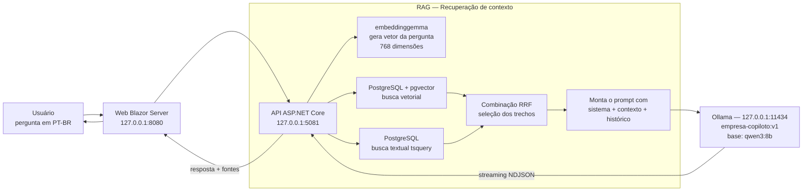

# Funcionamento da IA local (Ollama)

Diagrama e informações da IA que roda localmente, para uso em slide.

## Fluxo geral

## O modelo

| Item | Valor |
|---|---|
| Modelo de chat | `empresa-copiloto:v1` (base **qwen3:8b**) |
| Tamanho | 5.2 GB |
| Contexto (`num_ctx`) | 8192 tokens |
| Geração (`num_predict`) | até 512 tokens |
| Temperatura | 0.1 (respostas diretas, pouco criativas) |
| Modo thinking | desativado (`think: false` — respostas diretas e streaming de `content`) |
| Modelo de embeddings | `embeddinggemma` (621 MB, vetores de 768 dimensões) |
| Plataforma | Ollama 0.32.5 em `127.0.0.1:11434` |

### Por que qwen3:8b?

- **Qualidade em português:** família Qwen tem bom desempenho em PT-BR, essencial para um copiloto de empresa brasileira.
- **Roda 100% local:** 8B de parâmetros cabe confortavelmente em 8 GB de VRAM (ou em RAM), permitindo execução local sem custo de nuvem e sem enviar dados da empresa para fora.
- **Customizável via Modelfile:** o `docs/Modelfile` define system prompt com regras rígidas (responder só com o contexto fornecido, não inventar regras/preços/horários, não citar fontes, indicar atendimento humano quando não houver resposta confiável).
- **Modelo de embeddings leve:** `embeddinggemma` (621 MB) gera os vetores de busca com rapidez em hardware local.

## Computador que roda a IA

| Componente | Configuração |
|---|---|
| CPU | Intel Core i5-14600K (14 núcleos / 20 threads) |
| RAM | 32 GB (31.7 GB totais) |
| GPU | NVIDIA GeForce RTX 5060 — **8 GB VRAM** (confirmado via `nvidia-smi`) |
| Sistema | Windows 11 Home (build 26200) |
| Disco | 931 GB SSD (644 GB em uso) |
| Execução | Ollama 0.32.5 como processo local; modelos em `ollama list` |

## Como a IA funciona de ponta a ponta

1. O usuário faz uma pergunta na interface web.
2. A API gera o vetor da pergunta com o `embeddinggemma`.
3. O PostgreSQL (pgvector) busca os trechos mais similares (busca vetorial) e também busca por texto (tsquery em português); os resultados são combinados (RRF).
4. A API monta o prompt: instruções do sistema + trechos recuperados + histórico da conversa.
5. O Ollama gera a resposta em streaming (NDJSON) com o `empresa-copiloto:v1`.
6. A resposta é exibida ao usuário junto com as fontes utilizadas (dropdown "Fontes (N)").
