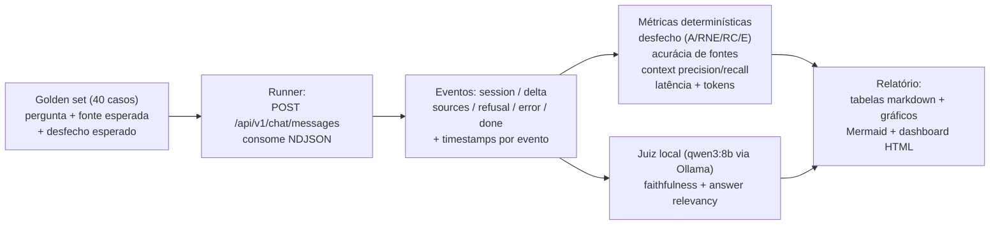
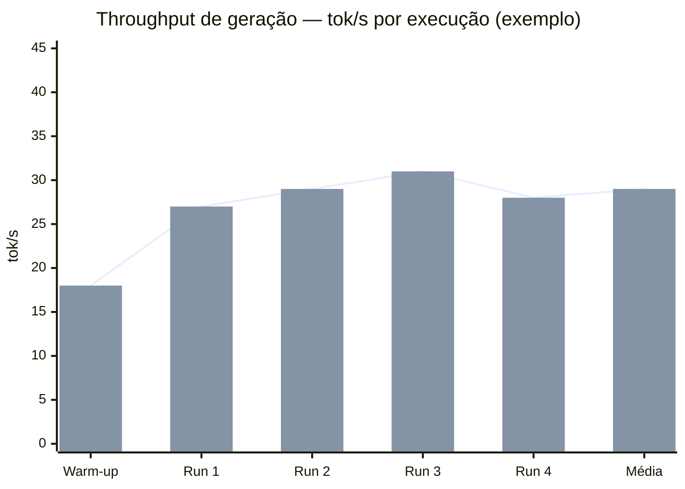

# Plano do Workbench — Avaliação do Modelo Local

## 1. Contexto e objetivo

O Copiloto RAG da Empresa é um sistema 100% local (Blazor Server + API ASP.NET Core +
PostgreSQL/pgvector + Ollama) que responde perguntas sobre um acervo de documentos
aprovados. O modelo de chat é o `empresa-copiloto:v1` (base `qwen3:8b`, `num_ctx 8192`,
`num_predict 512`, `temperature 0.1`, `think:false`), com embeddings `embeddinggemma`
(768 dimensões), rodando em uma RTX 5060 de 8 GB de VRAM.

Já existe avaliação manual em `docs/avaliacao-rag.md`: 40 casos curados (30 de resposta
esperada, 5 de recusa sem evidência, 3 de conflito, 2 de robustez/limites), com fonte
esperada e comportamento esperado. Há também suporte parcial de automação no admin
(endpoint `/api/v1/admin/evaluation-cases/{id}/run`, tabela `evaluation_cases`).

Este documento define o **workbench**: um padrão de bancada de avaliação, repetível e
mensurável, que transforma os 40 casos manuais em um processo quase automático de
medição de qualidade da recuperação (retrieval), da geração (geração) e do desempenho
(latência/custo), sem enviar nenhum dado para fora da máquina.

---

## 2. Modelo de workbench escolhido

**Nome do padrão: Bancada de avaliação por conjunto áureo (golden set) com juiz local
(LLM-as-judge local).**

É uma combinação de três padrões consolidados da literatura de avaliação de RAG,
adaptados ao contexto (pequeno, local, privado):

| Componente do padrão | O que é | Como se aplica aqui |
|---|---|---|
| **Golden set (conjunto áureo)** | Conjunto fixo e curado de casos (pergunta, fonte esperada, comportamento esperado, resposta de referência) usado como régua de regressão | Os 40 casos de `docs/avaliacao-rag.md` viram um dataset estruturado (JSONL) com metadados de fonte esperada e desfecho esperado; são a entrada fixa de todas as rodadas |
| **LLM-as-judge local** | Um modelo LLM que pontua respostas de outro modelo usando um rubric (fidelidade às fontes, relevância) | O próprio `qwen3:8b` (via Ollama em `127.0.0.1:11434`, `temperature 0`, `think:false`) julga a resposta do copiloto contra os trechos recuperados (evento `sources`) — nada sai da máquina |
| **Métricas estilo RAGAS** | Faithfulness, answer relevancy, context precision e context recall | Computadas localmente: as duas métricas de recuperação (precision/recall) de forma determinística contra as "fontes esperadas" do golden set; as duas de geração via juiz local |

### Fluxo da bancada



---

## 3. Explicação do motivo da escolha

### Por que faz sentido para este projeto

1. **O golden set já existe.** Os 40 casos de `docs/avaliacao-rag.md` são exatamente o
   que o padrão de golden set pede: perguntas reais do domínio, fonte esperada e
   comportamento esperado. O custo mais caro de qualquer bancada (curar o dataset) já
   foi pago. Só falta estruturá-lo em formato de máquina.
2. **Privacidade absoluta.** O projeto tem como premissa que nenhuma operação sai da
   máquina. RAGAS, TruLens e DeepEval por padrão chamam APIs de nuvem; aqui, o juiz é
   o próprio Ollama local. Métricas de recuperação (precision/recall) nem precisam de
   juiz: comparam a lista de fontes retornadas no evento `sources` com as fontes
   esperadas do golden set — 100% determinístico.
3. **Hardware suficiente, sem custo de GPU dedicada.** A RTX 5060 (8 GB VRAM) roda o
   `qwen3:8b` (juiz) confortavelmente em quantização Q4 (~5 GB). O juiz só roda em
   fase separada da geração (ver Plano de ação), então não há disputa de VRAM.
4. **Latência é um requisito do produto.** "Quão rápido responde" importa tanto
   quanto "responde certo". A bancada mede latência por fase (embedding+busca,
   tempo-para-primeiro-token, geração total) porque o modelo 8B local é o principal
   gargalo (documentado em `docs/arquitetura.md` §9).
5. **Regressão barata.** Com o golden set + runner, qualquer mudança (prompt,
   chunking, top-k, modelo) pode ser revalidada em uma rodada de ~15 minutos, em vez
   de avaliação manual dos 40 casos.

### Trade-offs e alternativas descartadas

| Alternativa | Por que foi descartada |
|---|---|
| **RAGAS (pacote Python) com juiz em nuvem (GPT-4o)** | É o padrão mais citado da literatura, mas o juiz em nuvem viola a premissa de privacidade e adiciona dependências pesadas (LangChain, datasets, etc.). Fica como evolução opcional apontando o `llm_factory("qwen3:8b")` para `127.0.0.1:11434/v1` — o mesmo código passa a rodar offline. |
| **TruLens (RAG Triad)** | Excelente (context relevance, groundedness, answer relevance), mas exige instrumentar o código com decorators/tracing e tem dashboard mais voltado a quem já usa Python+LLM de nuvem; aqui o valor está em um script simples e determinístico. |
| **DeepEval** | Forte em CI/pytest, mas a avaliação mais útil para este projeto (fonte esperada vs. fontes retornadas) já é resolvida deterministicamente; o custo de adotar o framework não compensa o ganho. |
| **Juiz maior/nuvem por qualidade de julgamento** | Juízes pequenos concordam com humanos em ~80% dos casos; para um copiloto consultivo de demo local, é aceitável — e a métrica determinística de fontes compensa parte desse ruído. |

**Trade-off central assumido:** o juiz local é menos confiável que um juiz de fronte
(alguns erros de pontuação), e respostas curtas/recusas precisam de rubric cuidadoso.
Em troca, o custo de rodada é praticamente zero (só energia), os dados não saem da
máquina e a rodada completa é rápida.

---

## 4. Métricas do workbench

| Métrica | O que mede | Como é calculada | Tipo |
|---|---|---|---|
| **Acurácia de desfecho** | O copiloto fez o comportamento esperado (A/RNE/RC/E)? | Compara o desfecho observado (respondeu, recusou sem evidência, recusou por conflito, erro) com o esperado por caso | Determinística |
| **Acurácia de fontes** | As fontes citadas no evento `sources` correspondem ao tema do caso | Para casos A: todas as fontes retornadas devem pertencer ao conjunto de documentos esperado (`Fonte esperada` do golden set) | Determinística |
| **Context precision@6** (precision) | De tudo o que foi recuperado (top-6), quanto era relevante? | `|retornadas ∩ esperadas| / 6` (por caso A), média | Determinística |
| **Context recall** (recall) | Do que era necessário, quanto foi recuperado? | `|retornadas ∩ esperadas| / |esperadas|` (por caso A), média | Determinística |
| **Faithfulness** | A resposta só afirma o que está nas fontes recuperadas? (1 − taxa de alucinação) | Juiz local quebra a resposta em afirmações e verifica cada uma contra os trechos recuperados: `afirmações apoiadas / total` | Juiz local (LLM-as-judge) |
| **Answer relevancy** | A resposta responde de fato à pergunta? | Estilo RAGAS: o juiz gera N perguntas a partir da resposta e mede similaridade cosseno (embeddings `embeddinggemma`) com a pergunta original | Juiz local + embeddings |
| **Taxa de alucinação** | Complemento da fidelidade | `1 − faithfulness` | Derivada |
| **Latência de busca** | Embedding + busca híbrida + avaliação de evidência | `tsources/refusal − tinício do request` (o evento `sources`/`refusal` só chega após a evidência ser avaliada) | Instrumentação |
| **TTFT** (tempo até o primeiro token) | Resposta começa em quanto tempo? | `tprimeiro delta − tinício do request` | Instrumentação |
| **Latência total** | Pergunta → `done` | `tdone − tinício do request` | Instrumentação |
| **Tokens gerados** | Economia do modelo | `eval_count`/`eval_duration` expostos pelo Ollama (via leitura do log da API ou medição) | Instrumentação |
| **Tokens/s de geração** (throughput) | Quantos tokens de saída o modelo entrega por segundo | `eval_count / (eval_duration / 1e9)` — via probe direto no Ollama (ver §4.1) | Probe direto |
| **Tokens/s de prefill** (entrada) | Velocidade de processamento do prompt (primeiro token) | `prompt_eval_count / (prompt_eval_duration / 1e9)` — mesmo probe | Probe direto |
| **Custo por rodada** | Custo monetário | R$ 0 de API; energia estimada (kWh da rodada × tarifa) | Estimativa |

### 4.1 Medição de tokens por segundo (throughput do modelo)

O Ollama entrega as métricas de desempenho no **JSON final** de `/api/chat` (e
`/api/generate`), tanto em `stream: false` quanto na última linha do streaming:

```json
{
  "model": "empresa-copiloto:v1",
  "eval_count": 214,
  "eval_duration": 6439812345,
  "prompt_eval_count": 892,
  "prompt_eval_duration": 2156778891
}
```

Fórmulas:

- **Tokens/s de geração (saída)** = `eval_count / (eval_duration / 1_000_000_000)`
- **Tokens/s de prefill (entrada)** = `prompt_eval_count / (prompt_eval_duration / 1_000_000_000)`

> **Importante:** o `OllamaClient` do projeto (`src/CompanyCopilot.Infrastructure/Ollama/OllamaClient.cs`, método `ChatStreamAsync`) **descarta essas métricas** — o streaming só repassa o `content` dos deltas até o frame `done`, e o NDJSON da API do copiloto não propaga `eval_count`/`eval_duration`. Por isso o throughput não sai das chamadas normais do copiloto; é preciso um **probe dedicado** (abaixo). Em contrapartida, o probe é um efeito colateral da arquitetura de streaming — as latências do produto (TTFT/total) continuam sendo medidas no runner pela via normal.

**Protocolo do probe (medição de throughput):**

1. Chamada direta ao Ollama com os **mesmos parâmetros do produto**: `model: empresa-copiloto:v1`, `stream: false`, `think: false`, `temperature: 0.1`, `options: { num_ctx: 8192, num_predict: 512 }`.
2. Prompt padronizado que gere resposta longa (ex.: pergunta do golden set com resposta extensa, ou texto de instrução fixo de ~1.500 caracteres) — o mesmo prompt em todas as execuções.
3. **N = 5 execuções**, descartando a 1ª (warm-up — VRAM fria subestima o resultado). Reportar **média, mediana e p95** de tok/s de saída e de prefill.
4. Rodar com a API do copiloto **ociosa** (o runner não deve disparar perguntas em paralelo — `MaxConcurrentGenerations=1` já impede concorrência), para o número refletir o modelo, não a disputa de recursos.
5. Opcional: capturar uso de GPU durante o probe com `nvidia-smi` (VRAM, utilização e clock) e anotar a quantização efetiva do modelo carregado.

Exemplo (PowerShell 5.1 — corpo sem BOM):

```powershell
$body = '{"model":"empresa-copiloto:v1","stream":false,"think":false,"messages":[{"role":"user","content":"Explique, em detalhes, o processo de atualização cadastral da empresa e seus prazos."}],"options":{"num_ctx":8192,"num_predict":512,"temperature":0.1}}'
$file = "$env:TEMP\probe-body.json"
[System.IO.File]::WriteAllText($file, $body, [System.Text.UTF8Encoding]::new($false))
curl.exe -s -X POST "http://127.0.0.1:11434/api/chat" -H "Content-Type: application/json" --data-binary "@$file"
```

**Aproximação em streaming (opcional):** no runner normal, dá para estimar o tok/s "de ponta a ponta" contando os tokens dos deltas (heurística do `TextChunker`: 4 caracteres ≈ 1 token) e dividindo pelo tempo entre o primeiro `delta` e o `done`. É uma aproximação (inclui overhead HTTP/NDJSON), complementar ao probe, que é o número oficial.

---

## 5. Resultados esperados

### 5.1 Alvos iniciais (a validar na primeira rodada, não chutes)

| Indicador | Meta inicial | Justificativa |
|---|---|---|
| Acurácia de desfecho (casos 1–35) | ≥ 37/40 no total; 100% nos RNE/RC | O sistema foi projetado com recusas determinísticas (sem evidência/conflito) que não chamam o modelo |
| Acurácia de fontes (casos A) | ≥ 90% | Busca híbrida + RRF + camadas; esperam-se poucos erros com 5 documentos bem distintos |
| Context precision@6 | ≥ 0,80 | `MaxRetrievedChunks=6` com top-10 por vetorial e textual |
| Context recall | ≥ 0,90 | Documentos de domínios separados; o recall tende a ser alto |
| Faithfulness | ≥ 0,85 | `temperature 0.1` + prompt forte de ancoragem; taxa de alucinação alvo < 10–15% |
| Answer relevancy | ≥ 0,80 | Modelo instruído a responder só o que foi perguntado |
| Latência de busca | 0,3–1,5 s | Embedding 768d local + 2 buscas + RRF, tudo no mesmo host |
| TTFT | 1–3 s | Geração Q4 em RTX 5060 (esperado ~20–40 tok/s) |
| Latência total | 5–20 s | 512 tokens máx.; respostas típicas 100–300 tokens |
| Custo por rodada completa (40 casos) | R$ 0 (API) + ~R$ 0,05–0,10 em energia | ~15 min de GPU (~150 W) → ~0,04 kWh; tarifa residencial típica |
| Throughput de geração | **20–40 tok/s** (qwen3:8b Q4 em RTX 5060) — validar no probe | Estimativa típica para 8B Q4 em GPU de 8 GB; o probe (§4.1) dá o número real |
| Throughput de prefill | **100–300 tok/s** (mesmo hardware) | Processamento do prompt costuma ser 5–10× mais rápido que a geração |

### 5.2 Comparativo local vs. nuvem (a medir, com expectativa)

| Dimensão | Local (esta bancada) | Nuvem típica (GPT-4o-mini) |
|---|---|---|
| TTFT | ~1–3 s | ~0,5–2 s |
| Latência total por resposta | ~5–20 s | ~2–8 s |
| Custo por resposta | R$ 0 (energia ~R$ 0,002–0,005) | ~US$ 0,0005–0,002 (tokens de entrada com contexto + saída) |
| Privacidade | Dados nunca saem do host | Dados vão para o provedor |
| Dependência de rede | Nenhuma | Requer internet + chave de API |
| Qualidade bruta | 8B local (menor) | Modelo de fronte (maior) |

A expectativa é que a bancada confirme: **o local perde em latência e qualidade
bruta, mas ganha em privacidade, previsibilidade de custo e disponibilidade** — e que
a distância de qualidade seja pequena para perguntas factuais diretas do acervo
(domínio fechado, 5 documentos), que é exatamente o caso de uso do copiloto.

---

## 6. Plano de ação passo a passo

### Fase 0 — Preparar o ambiente

1. Subir a solução (Postgres via `docker compose -f infra/docker-compose.yml up -d`,
   `ollama serve`, API :5081, Web :8080) conforme `docs/setup-windows.md`.
2. Garantir os 5 documentos de demonstração de `docs/exemplos/` ingeridos e aprovados
   (já estão no banco da demo local).
3. **Rate limit — decisão de configuração.** O chat limita a 8 perguntas/10 min por IP
   (`MaxQuestionsPerWindow=8`, `RateLimitWindowMinutes=10`), e 40 casos estourariam o
   limite. Estratégia recomendada:
   - Rodar o **caso 40 (429) antes de qualquer mudança**, com a configuração padrão
     (9 perguntas em sequência → a 9ª deve responder 429);
   - Depois, para a rodada dos casos 1–39, **elevar temporariamente**
     `MaxQuestionsPerWindow` (ex.: 60) no `appsettings` da API e restaurar ao final.
   - O caso 39 (> 2000 caracteres → 400) funciona em qualquer configuração.
4. Observar `MaxConcurrentGenerations=1`: o runner deve disparar as perguntas **em
   sequência** (nunca em paralelo), o que também é bom para medição de latência
   individual.

### Fase 1 — Estruturar o golden set

Converter os 40 casos de `docs/avaliacao-rag.md` em um arquivo de dados
`workbench/casos.jsonl`, um JSON por linha:

```json
{
  "id": 1,
  "pergunta": "Qual o horário de atendimento telefônico?",
  "categoria": "A",
  "fontes_esperadas": ["horario-atendimento"],
  "resposta_referencia": "Atendimento telefônico das 8h às 18h, de segunda a sexta.",
  "suíte": "principal"
}
```

- Casos 36–38 ficam em uma **suíte separada** (`suíte: "conflito"`): exigem carregar a
  versão alternativa do documento, rodar, e depois despublicar/remover a versão.
- Os casos 39–40 ficam como `suíte: "robustez"` (ver Fase 0 quanto à ordem).
- **Respostas de referência (ground truth)** só existem para os 30 casos A; devem ser
  criadas manualmente a partir do conteúdo de `docs/exemplos/*.md` (as fontes
  esperadas já existem na tabela do arquivo de avaliação). São usadas no context
  recall e na checagem qualitativa; criar à mão, não por LLM, para manter a
  integridade do padrão-ouro.

### Fase 2 — Escrever o runner (coleta)

Script Python (3.11+, venv, dependências mínimas: `requests` ou `httpx`; nada sai da
máquina). Para cada caso:

1. `POST http://127.0.0.1:5081/api/v1/chat/messages` com
   `{"sessionId": "<uuid-por-caso>", "text": "<pergunta>"}` (id de sessão único por
   caso mantém o histórico isolado e evita hidratação cruzada).
2. Consumir o NDJSON linha a linha, registrando:
   - `t_inicio` (antes do POST) e o timestamp de cada evento (`session`, `delta`,
     `sources`, `refusal`, `error`, `done`);
   - `desfecho` = `A` (houve `delta` e `sources`), `RNE` (`refusal` sem conflito),
     `RC` (`refusal` por conflito), `E` (`error`);
   - ids de documentos do evento `sources` (campo de fonte do `ChatSourceDto`);
   - concatenação dos `delta` = resposta final.
3. Tratar 400/429/erros de rede com retry curto e marcar desfecho `E` se persistir.
4. Gravar cada caso como linha em `workbench/resultados-<data>.jsonl` (pergunta,
   desfecho, fontes retornadas, resposta, latências, tokens se disponíveis).

### Fase 3 — Juiz local (faithfulness e answer relevancy)

Script separado (roda **depois** do runner, para não disputar VRAM com a geração):

1. Juiz = `POST http://127.0.0.1:11434/api/chat` com `{"model": "qwen3:8b",
   "think": false, "temperature": 0}` (mesmas regras do `docs/Modelfile`).
2. **Faithfulness** por caso A: prompt em PT-BR pedindo ao juiz para listar as
   afirmações da resposta e classificar cada uma como apoiada/não apoiada nos trechos
   recuperados (evento `sources` — os excertos truncados em 240 chars são suficientes
   para o julgamento; se preciso, reler os trechos do banco por `DocumentId`).
   `faithfulness = afirmações apoiadas / total`. Saída em JSON
   (`"format": "json"`), re-tentar com prompt corrigido se o parse falhar.
3. **Answer relevancy** estilo RAGAS: o juiz gera 3 perguntas que a resposta
   responderia; embeddings `embeddinggemma` (768d) das perguntas geradas e da pergunta
   original; pontuação = média do cosseno. (Alternativa mais simples: juiz direto
   `nota 0–1`, aceitável em primeira rodada.)
4. Recusas (RNE/RC) não passam pelo juiz de fidelidade (não há resposta) — são
   validadas pelo desfecho determinístico.

### Fase 4 — Métricas determinísticas

No próprio runner (ou script pós-processamento):

- `acurácia de desfecho`: desfecho observado == categoria esperada;
- `acurácia de fontes` e `context precision/recall`: interseção entre
  `fontes_esperadas` e as fontes do evento `sources` (normalizar por id de documento);
- `latência de busca = t(sources|refusal) − t_inicio`;
- `TTFT = t(primeiro delta) − t_inicio`; `latência total = t(done) − t_inicio`;
- se o log da API estiver em `Information`, o `OllamaClient` permite inferir
  `eval_count`/`eval_duration`; caso contrário, estimar tokens por comprimento do texto
  (4 chars/token, mesma heurística do `TextChunker`).
- **Probe de throughput (§4.1):** N=5 execuções diretas no Ollama com parâmetros do
  produto (descartar a 1ª como warm-up); calcular tok/s de geração e de prefill
  (`eval_count / (eval_duration/1e9)`); gravar média/mediana/p95 em
  `workbench/resultados-<data>.jsonl` junto com os demais resultados. Rodar com a API
  ociosa, antes ou depois da rodada de casos, nunca durante.

### Fase 5 — Relatório e visualização

O script de relatório gera a partir de `resultados-<data>.jsonl`:

1. **Tabela markdown por caso** (o mesmo formato de "Registro" de
   `docs/avaliacao-rag.md`, preenchido automaticamente);
2. **Tabela agregada** de métricas (incluindo **tok/s de geração e prefill** — média, mediana, p95);
3. **Gráfico Mermaid** com os alvos vs. obtidos (ver seção 7);
4. **Dashboard HTML simples** (arquivo estático com os dados embutidos como JSON,
   aberto no navegador local — zero servidor).

### Fase 6 — Análise e iteração

1. Comparar obtidos × alvos (seção 5.1) e inspecionar os casos fora da meta
   (recuperação ruim = mexer em top-k/RRF/chunking; fidelidade baixa = mexer no
   prompt/temperatura; relevância baixa = revisar instruções finais do prompt).
2. Salvar a rodada como **baseline** (`workbench/baseline.json`); mudanças no prompt,
   modelo ou busca só são aceitas se não regredirem as métricas além de um limiar
   (ex.: −0,05 em faithfulness ou −5 pontos de acurácia de desfecho).
3. Reexecutar é barato: rodada completa ≈ 10–20 min (geração) + ~5–10 min (juiz).

### Esboço de comandos/scripts (referência, não executar agora)

```powershell
# Subir serviços (Windows)
docker compose -f infra/docker-compose.yml up -d
ollama serve
dotnet run --project src/CompanyCopilot.Api    # :5081

# Smoke test do endpoint de chat (PowerShell 5.1 — corpo sem BOM)
$body = '{"sessionId":"eval-00000000-0000-0000-0000-000000000000","text":"Qual o horário de atendimento telefônico?"}'
$file = "$env:TEMP\chat-body.json"
[System.IO.File]::WriteAllText($file, $body, [System.Text.UTF8Encoding]::new($false))
curl.exe -s -N -X POST "http://127.0.0.1:5081/api/v1/chat/messages" `
  -H "Content-Type: application/json" --data-binary "@$file"
```

```python
# runner.py (esboço)
import json, time, uuid, requests

CASOS = "workbench/casos.jsonl"
API = "http://127.0.0.1:5081/api/v1/chat/messages"

def roda_caso(caso):
    t0 = time.perf_counter()
    r = requests.post(API, json={
        "sessionId": str(uuid.uuid4()),
        "text": caso["pergunta"],
    }, stream=True, timeout=300)
    deltas, fontes, desfecho, lat_busca, ttft = [], [], None, None, None
    for linha in r.iter_lines(decode_unicode=True):
        ev = json.loads(linha)
        agora = time.perf_counter() - t0
        if ev["type"] == "delta" and ttft is None:
            ttft = agora
            deltas.append(ev["text"])
        elif ev["type"] == "sources":
            lat_busca = agora
            fontes = ev["sources"]
        elif ev["type"] == "refusal":
            lat_busca = agora
            desfecho = "RC" if "conflito" in ev.get("errorMessage", "") else "RNE"
        elif ev["type"] == "error":
            desfecho = "E"
    return {
        "desfecho": desfecho or "A",
        "resposta": "".join(deltas),
        "fontes": fontes,
        "latencia_busca_s": lat_busca,
        "ttft_s": ttft,
        "latencia_total_s": time.perf_counter() - t0,
    }
```

```python
# juiz.py (esboço — faithfulness com qwen3:8b local, temperatura 0)
import json, requests

def faithfulness(resposta, trechos):
    prompt = (
        "Liste as afirmações da resposta abaixo e, para cada uma, diga se é "
        "apoiada pelos trechos fornecidos. Responda em JSON: "
        '{"afirmacoes":[{"texto":"...","apoiada":true|false}]}.\n\n'
        f"RESPOSTA: {resposta}\n\nTRECHOS:\n{trechos}"
    )
    r = requests.post("http://127.0.0.1:11434/api/chat", json={
        "model": "qwen3:8b", "think": False, "temperature": 0, "stream": False,
        "format": "json", "messages": [{"role": "user", "content": prompt}],
    }, timeout=180)
    data = json.loads(r.json()["message"]["content"])
    af = data["afirmacoes"]
    return sum(a["apoiada"] for a in af) / len(af) if af else 1.0
```

### Exemplo de visualização (Mermaid — gerado pelo relatório)

```mermaid
xychart-beta
    title "Workbench — alvo vs. obtido (exemplo)"
    x-axis ["Desfecho", "Fontes", "Precision@6", "Recall", "Faithfulness", "Relevância"]
    y-axis "Pontuação" 0 --> 1
    bar [0.93, 0.90, 0.80, 0.90, 0.85, 0.80]
    bar [0.95, 0.93, 0.87, 0.95, 0.88, 0.83]
```



Gráfico de throughput gerado a partir do probe (§4.1) — tok/s por execução com a
média/p95 destacada:



### Dashboard simples

Opção de baixo esforço: o relatório emite `workbench/dashboard.html` com os
resultados embutidos em `<script type="application/json">` e um CSS/JS mínimo (sem
dependência externa, sem servidor — abrir com `start workbench\dashboard.html`).
Mostra: tabela por caso (filtros por suíte/categoria), barras das métricas agregadas
e lista dos casos fora da meta.

---

## 7. Conteúdo final para o slide

> **Workbench de avaliação do modelo local**
>
> **O que usamos:** uma bancada de avaliação por conjunto áureo com juiz local —
> "golden set + LLM-as-judge". Os 40 casos já existentes de avaliação do copiloto
> viraram um conjunto fixo de testes (pergunta, fonte esperada, comportamento
> esperado). Cada caso é executado automaticamente contra a API real do copiloto, e
> as respostas são julgadas pelo próprio modelo local (qwen3:8b), sem nenhum dado
> sair da máquina.
>
> **Por que essa escolha:** o projeto é 100% local e privado — então o juiz não pode
> ser uma API de nuvem. O conjunto áureo já estava pronto (40 casos). O hardware
> (RTX 5060, 8 GB) roda o modelo e o juiz com folga, e cada rodada custa praticamente
> zero (só energia). O trade-off é que o juiz local concorda com um avaliador humano
> em ~80% dos casos, o que é aceitável para um copiloto consultivo de domínio fechado.
>
> **O que medimos:** fidelidade às fontes (a resposta só usa o que foi recuperado?),
> taxa de alucinação, qualidade da recuperação top-k (precision/recall), acerto do
> desfecho esperado (responder ou recusar), latência por fase e custo.
>
> **Resultados esperados (primeira rodada):** fidelidade ≥ 0,85 (alucinação < 15%),
> acurácia de desfecho ≥ 37/40, fontes corretas ≥ 90%, primeira resposta em ~1–3 s e
> resposta completa em ~5–20 s, **throughput de geração de 20–40 tokens por segundo**
> (medido com probe direto no Ollama — o número exato de tok/s do modelo local no
> nosso hardware), custo de R$ 0 em API. Comparado à nuvem, perdemos em
> velocidade bruta, mas ganhamos em privacidade, custo previsível e independência de
> rede — e, para perguntas factuais sobre os documentos, a qualidade fica próxima.

---

## 8. Referências

**Padrões e métricas**

- RAGAS — framework de avaliação de RAG (faithfulness, answer relevancy, context
  precision, context recall): https://docs.ragas.io/en/stable/ e
  https://docs.ragas.io/en/stable/concepts/metrics/available_metrics/
- Artigo original do RAGAS (Es, James, et al.): https://arxiv.org/abs/2309.15217
- TruLens — RAG Triad (context relevance, groundedness, answer relevance):
  https://www.trulens.org/getting_started/core_concepts/rag_triad
- DeepEval — framework com pytest/CI e guia do RAG Triad: https://deepeval.com/ e
  https://deepeval.com/guides/guides-rag-triad
- LLM-as-a-judge (Artigo "Judging LLM-as-a-Judge with MT-Bench and Chatbot Arena"):
  https://arxiv.org/abs/2306.05685

**Guias e benchmarks**

- Evidently — guia completo de avaliação de RAG (métricas, testes e boas práticas):
  https://www.evidentlyai.com/llm-guide/rag-evaluation
- Patronus AI — métricas de avaliação de RAG (context relevance/sufficiency, answer
  relevance/correctness/hallucination): https://www.patronus.ai/llm-testing/rag-evaluation-metrics
- Benchmarking Agents — RAG Evaluation 2026 (thresholds e tamanho mínimo de golden
  set: 30 casos para sinal direcional, 100 para confiabilidade):
  https://benchmarkingagents.com/rag-eval
- Snowflake — benchmarking de LLM-as-judge para o RAG Triad:
  https://www.snowflake.com/en/blog/engineering/benchmarking-LLM-as-a-judge-RAG-triad-metrics

**RAGAS + Ollama local (offline, sem chave de API)**

- Tutorial de avaliação de RAG com RAGAS e Qwen2.5-7B servido no Ollama (nota: modelos
  < ~7B erram JSON estruturado; usar o 8B local como juiz):
  https://jheiduk.com/posts/ragas-evaluation-tutorial/
- RAGAS com juiz local via Ollama (2026):
  https://vucense.com/dev-corner/ragas-rag-evaluation-local-ollama-2026/
- Pipeline de avaliação 100% local com Ragas + Ollama (sem chave de API):
  https://3k1o.blogspot.com/2026/02/building-local-llm-evaluation-pipeline.html

**Bancadas com golden set e regressão (referência de design)**

- evalharness — harness com golden sets, LLM-as-judge, baseline e gate de CI:
  https://github.com/siddhashutosh/evalharness

---

## Apêndice A — Mapeamento para o sistema atual

| Recurso do projeto | Uso no workbench |
|---|---|
| `docs/avaliacao-rag.md` | Fonte dos 40 casos (golden set) |
| `POST /api/v1/chat/messages` (NDJSON) | Runner — caminho recomendado (sem antiforgery; sessão por caso) |
| Evento `sources` (NDJSON) | Fontes retornadas → context precision/recall e entrada do juiz |
| Eventos `refusal`/`error`/`done` | Desfecho e métricas de robustez |
| `/api/v1/admin/evaluation-cases/{id}/run` | Alternativa existente (já grava `Passed/Failed` e `ExecutionNotes`); o workbench adiciona métricas contínuas, latência e juiz local |
| `OllamaOptions.ChatModel` / `EmbeddingModel` | Juiz (`qwen3:8b`) e embeddings (`embeddinggemma`) — reutiliza os modelos já baixados |
| `ChatOptions.MaxRetrievedChunks` (6) | Tamanho do contexto avaliado (precision@6) |
| `VectorSearchOptions` (top-10, RRF K=60) | Parâmetros cuja variação pode ser comparada entre rodadas |
| `ChatOptions.MaxQuestionsPerWindow` (8/10 min) | Restrição a contornar na rodada (Fase 0) |
| `docs/exemplos/*.md` | Base para criar as respostas de referência (ground truth) dos 30 casos A |
