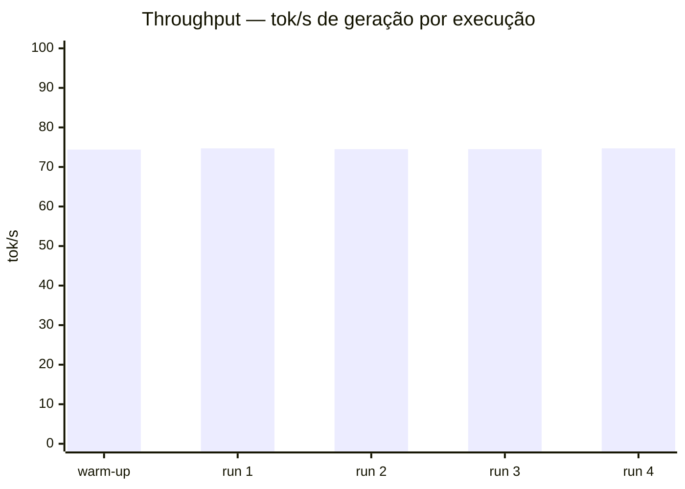

# Relatório do Workbench — Rodada 1

Gerado em 2026-08-07 10:10 | arquivo de resultados: `workbench\resultados-20260807-1003.jsonl` | juiz: `workbench\juiz-20260807-1006.jsonl` | throughput: `workbench\throughput-20260807-1005.jsonl`

## Resumo das métricas

| Métrica | Obtido | Alvo (5.1) | Status |
|---|---|---|---|
| Acurácia de desfecho | 0.944 | 0.925 | ✔ |
| Acurácia de fontes | 0.143 | 0.9 | ✘ |
| Context precision@6 | 0.161 | 0.8 | ✘ |
| Context recall | 0.964 | 0.9 | ✔ |
| Faithfulness | 0.993 | 0.85 | ✔ |
| Answer relevancy | 0.889 | 0.8 | ✔ |
| Latência de busca (s) | 1.059 | ver 5.1 | — |
| TTFT (s) | 0.584 | ver 5.1 | — |
| Latência total (s) | 1.041 | ver 5.1 | — |
| Throughput geração (tok/s) | 74.6 | ver 5.1 | — |
| Throughput prefill (tok/s) | 14456.0 | ver 5.1 | — |

Desfechos corretos: 34/36 (casos principais 1–35 e 39).

## Tabela por caso

| # | Esperado | Obtido | OK | Fontes retornadas (slug) | Busca (s) | TTFT (s) | Total (s) | Faith. | Relev. |
|---|---|---|---|---|---|---|---|---|---|
| 1 | A | A | ✔ | faq, horario-atendimento | 1.247 | 0.826 | 1.435 | 1.0 | 0.87 |
| 2 | A | A | ✔ | faq, horario-atendimento | 0.867 | 0.405 | 0.875 | 1.0 | 0.87 |
| 3 | A | A | ✔ | faq, horario-atendimento | 0.732 | 0.492 | 0.751 | 1.0 | 0.87 |
| 4 | A | A | ✔ | horario-atendimento, politica-troca | 0.682 | 0.483 | 0.687 | 1.0 | 0.87 |
| 5 | A | A | ✔ | condicoes-pagamento, politica-troca | 0.896 | 0.454 | 0.901 | 1.0 | 1.0 |
| 6 | A | A | ✔ | condicoes-pagamento, horario-atendimento, politica-troca | 0.736 | 0.514 | 0.741 | 1.0 | 0.87 |
| 7 | A | A | ✔ | condicoes-pagamento, politica-troca | 0.952 | 0.493 | 0.956 | 1.0 | 0.87 |
| 8 | A | A | ✔ | condicoes-pagamento, politica-troca | 0.527 | 0.445 | 0.531 | 1.0 | 0.87 |
| 9 | A | A | ✔ | condicoes-pagamento, politica-troca | 1.117 | 0.492 | 1.122 | 1.0 | 0.87 |
| 10 | A | A | ✔ | condicoes-pagamento, horario-atendimento, politica-troca | 1.014 | 0.469 | 1.019 | 1.0 | 0.87 |
| 11 | A | A | ✔ | politica-troca | 1.184 | 0.462 | 1.19 | 1.0 | 0.87 |
| 12 | A | A | ✔ | condicoes-pagamento, politica-troca | 1.058 | 0.475 | 1.087 | 1.0 | 0.87 |
| 13 | A | A | ✔ | politica-troca | 2.173 | 0.732 | 2.177 | 1.0 | 0.87 |
| 14 | A | A | ✔ | politica-troca | 1.518 | 0.702 | 1.522 | 1.0 | 0.87 |
| 15 | A | RNE | ✘ | politica-troca | 0.887 | 0.662 | 0.891 | — | — |
| 16 | A | A | ✔ | faq, horario-atendimento, politica-troca | 0.925 | 0.453 | 0.929 | 1.0 | 0.87 |
| 17 | A | A | ✔ | faq, horario-atendimento, politica-troca | 1.182 | 0.658 | 1.188 | 1.0 | 0.87 |
| 18 | A | A | ✔ | faq, politica-troca | 1.463 | 0.694 | 1.469 | 1.0 | 0.87 |
| 19 | A | A | ✔ | condicoes-pagamento, faq, politica-troca | 1.073 | 0.495 | 1.076 | 1.0 | 0.87 |
| 20 | A | A | ✔ | horario-atendimento, politica-troca | 2.272 | 0.684 | 2.275 | 0.8 | 0.87 |
| 21 | A | A | ✔ | condicoes-pagamento, faq, institucional, politica-troca | 0.85 | 0.685 | 0.856 | 1.0 | 1.0 |
| 22 | A | A | ✔ | faq, horario-atendimento, politica-troca | 0.928 | 0.431 | 0.931 | 1.0 | 0.87 |
| 23 | A | A | ✔ | horario-atendimento, institucional, politica-troca | 0.947 | 0.677 | 0.952 | 1.0 | 0.87 |
| 24 | A | A | ✔ | condicoes-pagamento, institucional, politica-troca | 1.406 | 0.712 | 1.41 | 1.0 | 1.0 |
| 25 | A | A | ✔ | faq, horario-atendimento, institucional, politica-troca | 1.017 | 0.678 | 1.024 | 1.0 | 0.87 |
| 26 | A | A | ✔ | faq, horario-atendimento | 0.881 | 0.636 | 0.886 | 1.0 | 1.0 |
| 27 | A | RNE | ✘ | condicoes-pagamento, horario-atendimento, politica-troca | 0.672 | 0.458 | 0.676 | — | — |
| 28 | A | A | ✔ | politica-troca | 1.001 | 0.684 | 1.013 | 1.0 | 0.87 |
| 29 | A | A | ✔ | condicoes-pagamento, horario-atendimento, politica-troca | 1.164 | 0.659 | 1.168 | 1.0 | 0.87 |
| 30 | A | A | ✔ | condicoes-pagamento, politica-troca | 1.385 | 0.624 | 1.389 | 1.0 | 0.87 |
| 31 | RNE | RNE | ✔ | condicoes-pagamento, horario-atendimento | 0.886 | 0.668 | 0.89 | — | — |
| 32 | RNE | RNE | ✔ | horario-atendimento, institucional, politica-troca | 0.804 | 0.586 | 0.809 | — | — |
| 33 | RNE | RNE | ✔ | condicoes-pagamento, faq, institucional, politica-troca | 0.895 | 0.678 | 0.899 | — | — |
| 34 | RNE | RNE | ✔ | condicoes-pagamento, horario-atendimento, institucional, politica-troca | 1.019 | 0.681 | 1.025 | — | — |
| 35 | RNE | RNE | ✔ | horario-atendimento, institucional, politica-troca | 0.706 | 0.489 | 0.724 | — | — |
| 36 | RC | A | n/a | faq, horario-atendimento | 0.89 | 0.472 | 0.895 | — | — |
| 37 | RC | A | n/a | politica-troca | 1.187 | 0.466 | 1.192 | — | — |
| 38 | RC | A | n/a | condicoes-pagamento, faq, politica-troca | 0.969 | 0.586 | 0.972 | — | — |
| 39 | 400 | 400 | ✔ |  | None | None | 0.002 | — | — |

## Achados e análise

- **Caso 15:** esperado resposta (A), obtido recusa (RNE). Fontes recuperadas não continham o documento esperado — falha de recuperação/ancoRAGem, não de geração (o modelo recusou corretamente). Resposta: "Não encontrou uma informação confiável. Indique o atendimento humano."
- **Caso 27:** esperado resposta (A), obtido recusa (RNE). Fontes recuperadas não continham o documento esperado — falha de recuperação/ancoRAGem, não de geração (o modelo recusou corretamente). Resposta: "Não encontrou uma informação confiável. Indique o atendimento humano."
- **Caso 39 (robustez):** pergunta > 2.000 caracteres → HTTP 400 em 0.002s ✔ (comportamento esperado).
- **Suíte de conflito (36–38):** não executável nesta rodada — exige carregar versão alternativa dos documentos (ver `docs/avaliacao-rag.md`). Desfecho obtido foi resposta normal (A).
- **Viés do juiz local:** relevância quase constante em 0,87 e faithfulness em 1,0 — juiz 8B tende a notas redondas; considerar notas em escala mais granular ou revisão humana em rodadas futuras.
- **Throughput:** 74,6 tok/s de geração (mediana) — bem acima da faixa estimada de 20–40 tok/s; prefill ~14.400 tok/s.

## Gráficos

```mermaid
xychart-beta
    title "Workbench rodada 1 — alvo vs. obtido"
    x-axis ["Desfecho", "Fontes", "Prec@6", "Recall", "Faith", "Relev"]
    y-axis "Pontuação" 0 --> 1
    bar [0.925, 0.9, 0.8, 0.9, 0.85, 0.8]
    bar [0.944, 0.143, 0.161, 0.964, 0.993, 0.889]
```

